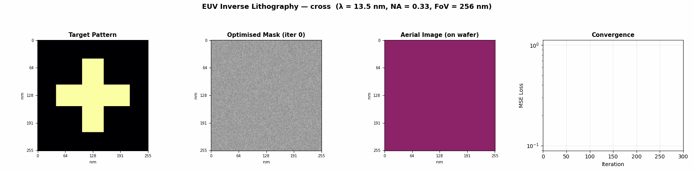
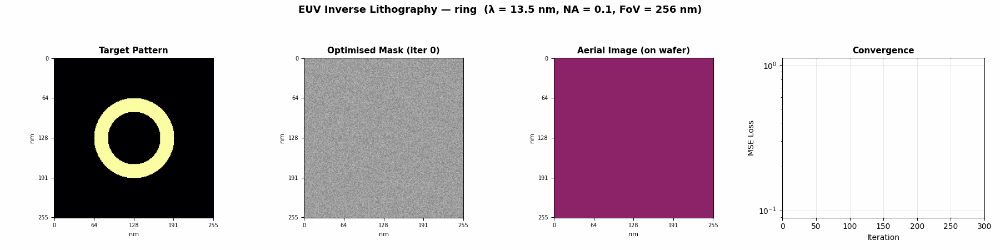
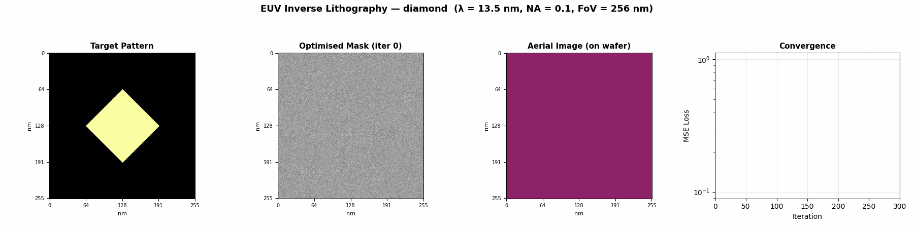
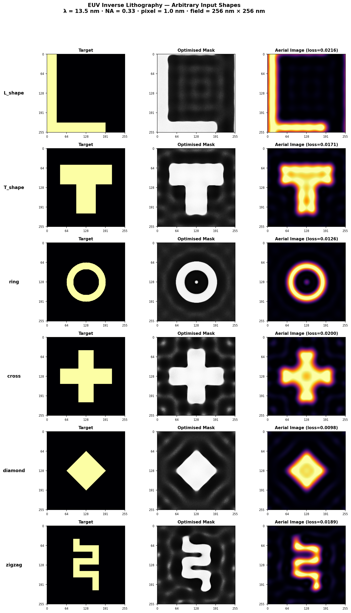
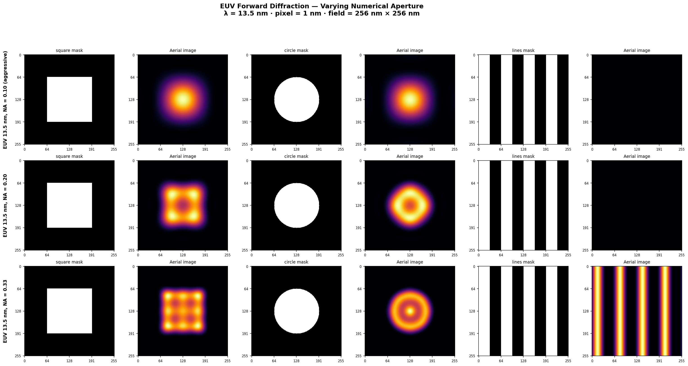
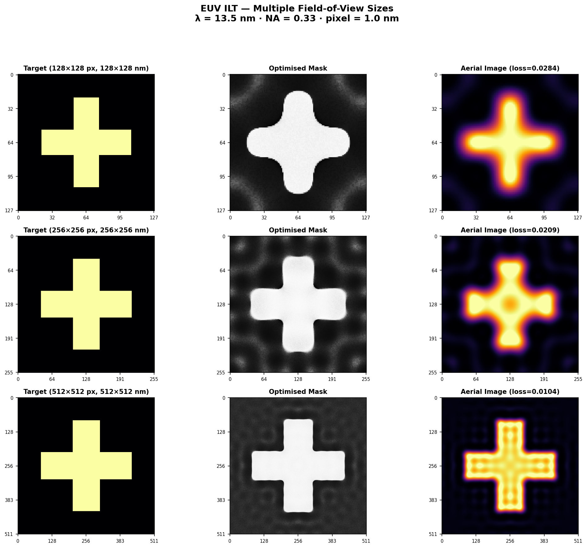
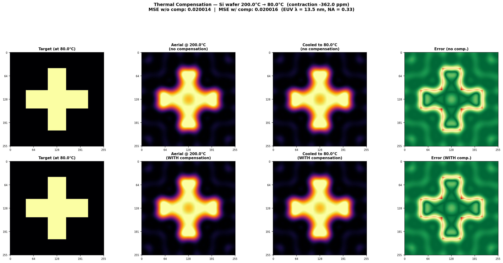

# Computational Lithography Engine

A differentiable physics engine for **EUV (Extreme Ultraviolet) computational lithography**, simulating Fraunhofer diffraction and implementing inverse mask optimisation in PyTorch. Designed around ASML-class EUV parameters (λ = 13.5 nm).

## Visual Proof — It Works!

### Inverse Mask Optimisation (Animated)

The engine automatically finds the optimal photomask that produces any desired chip pattern under realistic EUV diffraction. Watch the optimiser converge in real time — note how the **optimised mask differs significantly from the target** due to diffraction compensation:







### Arbitrary Input Shapes

The engine handles **any** target geometry — L-shapes, T-shapes, rings, crosses, diamonds, zigzags, and more. All at nm-scale with visible EUV diffraction effects:



### EUV Forward Diffraction — Varying Numerical Aperture

Forward diffraction simulation at **λ = 13.5 nm** across different NA values (0.25, 0.33, 0.55 High-NA). Axes are labelled in nanometres. Diffraction effects (blurring, ringing, Airy patterns) are clearly visible:



### Multiple Field-of-View Sizes

Works with any mask dimensions — demonstrated here at 128 nm, 256 nm, and 512 nm fields of view:



### Thermal Compensation (Silicon Wafer Heating & Cooling)

During EUV lithography the wafer is hot (200 °C). When it cools to operating temperature (80 °C), silicon contracts according to its temperature-dependent coefficient of thermal expansion (CTE). Without compensation the printed pattern shrinks and no longer matches the target. The engine pre-compensates the mask so the **cooled-down chip perfectly matches the intended geometry**:



### Thermal-Aware Optimisation (Animated)

Full thermal-aware inverse lithography: the optimiser accounts for silicon thermal expansion coefficients so the pattern at 80 °C matches the target:


---

## Overview

This engine provides a complete framework for **EUV computational lithography** simulations, including:

- **Fraunhofer Diffraction Simulation**: Physics-based modelling of far-field diffraction patterns using FFT with correct physical-units pupil function (cutoff = NA/λ)
- **Inverse Lithography Technology (ILT)**: Gradient-based optimisation to find optimal mask patterns that compensate for diffraction
- **Thermal Expansion Modelling**: Silicon wafer heating/cooling effects with temperature-dependent CTE (Okada & Tokumaru, 1984)
- **Thermal-Aware Optimisation**: Pre-compensates masks so the cooled chip (80 °C) matches the target geometry
- **Differentiable Architecture**: Built on PyTorch for automatic differentiation and GPU acceleration
- **EUV-Focused**: Default parameters set for λ = 13.5 nm, NA = 0.33, nm-scale pixel size — where diffraction effects are significant and clearly visible

## Installation

### From Source

```bash
git clone https://github.com/yup-VARUN/computational-lithography-engine.git
cd computational-lithography-engine
pip install -r requirements.txt
pip install -e .
```

### Requirements

- Python >= 3.7
- PyTorch >= 1.9.0
- NumPy >= 1.19.0
- Matplotlib >= 3.3.0
- imageio >= 2.9.0 (for GIF generation only)

## Quick Start

### Forward Diffraction Simulation

```python
import torch
from litho_engine import FraunhoferDiffraction
from litho_engine.diffraction import create_test_mask

# Create diffraction model (EUV lithography parameters)
diffraction = FraunhoferDiffraction(
    wavelength=13.5,   # nm — EUV
    pixel_size=1.0,    # nm per pixel
    NA=0.33            # Numerical aperture
)

# Create a test mask
mask = create_test_mask(size=128, pattern_type='square')

# Simulate diffraction
intensity = diffraction(mask)
```

### Inverse Mask Optimization

```python
from litho_engine import MaskOptimizer

# Define target pattern
target = create_test_mask(size=128, pattern_type='circle')

# Initialize optimizer
optimizer = MaskOptimizer(
    diffraction_model=diffraction,
    mask_shape=(128, 128),
    learning_rate=0.05,
    regularization=0.01
)

# Optimize mask to match target
results = optimizer.optimize(
    target=target,
    num_iterations=100,
    verbose=True
)

optimized_mask = results['mask']
```

### Thermal-Aware Optimization

```python
from litho_engine import ThermalExpansionModel
from litho_engine.optimizer import ThermalAwareMaskOptimizer

# Define thermal model: wafer at 200°C during exposure, cooled to 80°C
thermal = ThermalExpansionModel(
    process_temp=200.0,   # °C during lithography
    operating_temp=80.0   # °C final chip temperature
)

# The optimizer automatically pre-compensates for thermal contraction
optimizer = ThermalAwareMaskOptimizer(
    diffraction_model=diffraction,
    mask_shape=(128, 128),
    thermal_model=thermal,
    learning_rate=0.05,
    regularization=0.005
)

results = optimizer.optimize(target=target, num_iterations=200, verbose=True)
# The cooled-down chip will match the target geometry
```

## Generate Visualizations

To regenerate all images and animations:

```bash
pip install imageio
python examples/generate_visualizations.py
```

Output is saved to `docs/images/`.

## Examples

Run the provided examples to see the engine in action:

```bash
# Forward diffraction simulation
python examples/forward_diffraction.py

# Inverse mask optimization
python examples/inverse_optimization.py

# Generate all visualizations and animations
python examples/generate_visualizations.py
```

## Architecture

### Core Components

#### 1. FraunhoferDiffraction

Simulates far-field diffraction using the Fraunhofer approximation:

- **Input**: Binary or grayscale mask pattern
- **Process**: FFT-based diffraction with pupil function filtering
- **Output**: Intensity distribution at the image plane

Key features:
- Fully differentiable for gradient-based optimization
- Supports both coherent and partially coherent illumination
- Configurable optical parameters (wavelength, NA, pixel size)

#### 2. MaskOptimizer

Implements inverse lithography technology (ILT):

- **Objective**: Find optimal mask that produces desired target pattern
- **Method**: Gradient descent using PyTorch's autograd
- **Regularization**: Total variation (TV) for smooth masks
- **Loss Functions**: MSE, L1, Binary Cross-Entropy

#### 3. AdaptiveMaskOptimizer

Enhanced optimizer with:
- Adaptive learning rate scheduling
- Early stopping to prevent overfitting
- Better convergence for complex patterns

#### 4. ThermalExpansionModel

Models silicon wafer thermal expansion/contraction:

- Temperature-dependent CTE using polynomial fit (Okada & Tokumaru, 1984)
- Computes linear strain from process to operating temperature
- Applies geometric scaling via differentiable affine transforms
- Pre-compensates patterns so cooled chips match intended geometry

#### 5. ThermalAwareMaskOptimizer

Combines inverse lithography with thermal compensation:

- Automatically expands the optimization target to account for cooling contraction
- Ensures the final chip at operating temperature matches the desired pattern
- Uses the same adaptive LR scheduling and early stopping as AdaptiveMaskOptimizer

## Physics Background

### Fraunhofer Diffraction

In the far-field regime, the diffraction pattern is the Fourier transform of the aperture function:

```
U(x,y) = F{A(ξ,η)}
I(x,y) = |U(x,y)|²
```

Where:
- `A(ξ,η)` is the aperture/mask function
- `U(x,y)` is the complex field at the image plane
- `I(x,y)` is the intensity distribution
- `F{}` denotes Fourier transform

### Numerical Aperture

The pupil function limits the spatial frequencies that can pass through the optical system. The cutoff is determined by the physical relationship between NA and wavelength:

```
P(fx,fy) = 1 if √(fx² + fy²) ≤ NA/λ   (cycles/nm)
         = 0 otherwise
```

This creates the fundamental resolution limit in optical lithography. For EUV at λ = 13.5 nm with NA = 0.33, the cutoff frequency is ~0.024 cycles/nm, meaning features smaller than ~20 nm are strongly diffracted.

### Inverse Optimization

The optimization problem:

```
minimize: L(I_predicted, I_target) + λ·R(mask)
```

Where:
- `L` is the loss function (e.g., MSE)
- `R` is the regularization term (e.g., total variation)
- `λ` is the regularization weight

### Thermal Expansion

Silicon's coefficient of thermal expansion (CTE) varies with temperature:

```
CTE(T) = a₀ + a₁·T + a₂·T²
```

The linear thermal strain from cooling:

```
ε = -∫(T_operating to T_process) CTE(T) dT
```

The mask is pre-compensated by a scale factor of `1/(1 + ε)` so that after the wafer contracts upon cooling to the operating temperature, the final pattern geometry matches the intended target.

## Testing

Run the test suite:

```bash
pytest tests/test_litho_engine.py -v
```

Tests cover:
- Forward diffraction correctness
- Gradient flow verification
- Optimization convergence
- Edge cases and constraints
- Thermal expansion model (CTE, strain, contraction, pre-compensation)
- Thermal-aware mask optimization

## Applications

This engine can be used for:

1. **Semiconductor Manufacturing**: Optimize photomask designs for chip fabrication
2. **Optical Engineering**: Analyze diffraction patterns in optical systems
3. **Research**: Study inverse problems in computational imaging
4. **Education**: Demonstrate wave optics and optimization principles

## Performance Tips

- **GPU Acceleration**: Move models to GPU for faster computation:
  ```python
  diffraction = diffraction.cuda()
  mask = mask.cuda()
  ```

- **Batch Processing**: Process multiple masks simultaneously:
  ```python
  masks = torch.stack([mask1, mask2, mask3])
  intensities = diffraction(masks)
  ```

- **Memory Management**: Use smaller mask sizes or gradient checkpointing for large optimizations

## Limitations

- Assumes Fraunhofer (far-field) approximation
- Coherent or simple partially coherent illumination models
- Does not include resist effects or 3D mask topography
- Simplified pupil function model

## Future Enhancements

- [ ] Hopkins partially coherent imaging model
- [ ] Resist model integration (Mack model, etc.)
- [ ] 3D mask effects (thick mask modeling)
- [ ] Advanced source optimization
- [ ] Multi-objective optimization

## Contributing

Contributions are welcome! Please feel free to submit issues or pull requests.

## License

MIT License

## References

- Wong, A. K. K. (2001). *Resolution Enhancement Techniques in Optical Lithography*
- Goodman, J. W. (2005). *Introduction to Fourier Optics*
- Ma, X., & Arce, G. R. (2010). "Computational Lithography"
- Okada, Y., & Tokumaru, Y. (1984). "Precise determination of lattice parameter and thermal expansion coefficient of silicon between 300 and 1500 K" — *J. Appl. Phys.* 56, 314

## Citation

If you use this engine in your research, please cite:

```bibtex
@software{computational_lithography_engine,
  author = {VARUN},
  title = {Computational Lithography Engine},
  year = {2024},
  url = {https://github.com/yup-VARUN/computational-lithography-engine}
}
```

A good read [Nature Article](https://www.nature.com/articles/s41377-025-01923-w)
